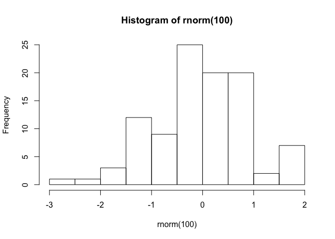

Joan’s Notebook
================

# Day 2 - R Course

## Yesterday’s tasks:

  - Island Tour


This adoesn´t have be code

``` r
#THIS MUST BE R CODE
print("this will work")
```

    ## [1] "this will work"

``` r
hist(rnorm(100))
```

<!-- --> i enjoying
like crazy
